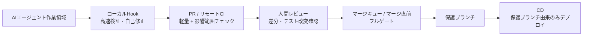

## 案の要旨

AIエージェントにはローカルHookで高速に自己修正させるが、信頼の根拠は必ずリモートCIの必須チェックとブランチ保護に置く。CIは「PR更新時の軽量・影響範囲チェック」と「マージ直前の重い完全ゲート」に分け、エージェントの大量コミットはタスク完了単位のpushと古いCI実行の自動キャンセルで吸収する。テスト改変・CI/Hook設定改変は通常コードより高リスクな差分として検出し、人間承認とフルゲートを必須にする。

## 設計

全体を次の4層に分ける。

基本方針は、ローカルHookを「開発速度のためのフィードバック」、リモートCIを「マージ可否を決める強制ゲート」として扱うことにする。Hookが通ったことはPR説明に記録してよいが、マージ条件にはしない。マージ条件はリモート側の必須チェックだけで構成する。

### 1. エージェントのpush運用

AIエージェントは作業中に多数の小さなコミットを作ってよいが、リモートへは原則として「タスク完了時」または「レビュー可能な単位になった時」だけpushする。ローカルの小コミットは、push前に1〜3個の論理コミットへ整理する。

推奨するPR単位は次のとおり。

- 1 PR = 1つの仕様変更、バグ修正、またはリファクタリング単位。
- テスト変更を含む場合はPR本文に「なぜテストを変えたか」を必須記載。
- CI設定、Hook設定、テスト基盤の変更は通常機能変更と混ぜず、可能なら独立PRにする。
- 大きな変更は、レビュー可能な中間PRへ分割する。エージェントの内部試行錯誤をそのままリモートに流さない。

これにより、CI発火数は「エージェントの全コミット数」ではなく「PR更新回数」に近づく。例えば、1タスク内でエージェントが多数のローカルコミットを作っても、リモートpushが1回ならPR CIの発火は1回になる。実測値はないため削減率は断定しないが、発火単位をコミットからタスク完了スナップショットへ変えることで、CI実行回数はローカルで束ねたコミット数に概ね反比例して減る見通しになる。

### 2. ローカルHookで実行するもの

ローカルHookは、エージェントが早く失敗に気づき、不要なPR更新を減らすために使う。迂回可能であることを前提に、品質保証の最終根拠にはしない。

| タイミング | 実行内容 | 目的 | 失敗時の扱い |
| --- | --- | --- | --- |
| ファイル編集後 | フォーマット、対象ファイルのlint | 即時修正 | エージェントが修正を試みる |
| コミット前 | 変更範囲のlint、軽量型検査、関連ユニットテスト | 壊れたコミットを減らす | 原則コミットしない。ただし最終判断ではない |
| タスク終了時 | 影響範囲のテスト、ビルド可能性確認、差分要約生成 | push前の自己確認 | 失敗したらpushしない方針 |
| push前 | PR本文の検証結果テンプレート作成 | レビュー補助 | 未記載ならPRで警告 |

Hook設定には「何を実行したか」をログとして残し、PR本文に貼れる形にする。ただし、そのログは自己申告であり、リモートCIの代替にはしない。

### 3. リモートCIの段階設計

リモートCIは3段階に分ける。

#### Tier 0: Policy Guard

すべてのPR更新で必ず実行する軽量チェック。これはブランチ保護の必須チェックにする。

内容は次のとおり。

- 変更ファイル一覧の取得。
- テストファイル削除、テストスキップ追加、アサーション削減の疑い検出。
- CI設定、Hook設定、テストランナー設定、依存関係定義などの保護パス改変検出。
- PR本文に、ローカルで実行した検証とテスト変更理由が記載されているか確認。
- 危険差分がある場合は、専用ラベルまたは人間レビュアー承認がない限り失敗。

このチェックは軽く保ち、常に走らせる。対象は品質ゲートの改変そのものなので、通常のパスフィルタでは省略しない。

#### Tier 1: Impact Check

PR更新時に、変更ファイルに応じた影響範囲だけを実行する。これもマージ前の必須チェックにするが、重い統合テストを毎回走らせない。

実行例は次のとおり。

| 変更種別 | 実行するリモートチェック |
| --- | --- |
| ドキュメントのみ | Policy Guard、ドキュメント形式チェック |
| 単一パッケージのコード | そのパッケージのlint、型検査、ユニットテスト、ビルド |
| 複数パッケージに跨るコード | 各パッケージのlint、型検査、ユニットテスト、依存先のビルド |
| 共通ライブラリ | 依存する全パッケージの対象テスト |
| テスト変更 | 対応する本体コードのテスト、テスト弱体化検出、必要ならフルテスト |
| CI/Hook/テスト基盤変更 | Policy Guard、フルゲート、保護パス承認 |

影響範囲の判定には、最初は単純なパス対応表を使う。例えば、`packages/a/**` が変わったら `a` のlint・型検査・テストを走らせる、共通ディレクトリが変わったら依存する複数領域を走らせる、という形で始める。依存グラフが整備されている場合のみ、より細かいテスト選択に拡張する。

CI削減策として、次を標準設定にする。

- 同一ブランチ・同一PRの古いCI実行は自動キャンセルする。
- 依存関係、ビルド成果物、テストキャッシュを使う。
- lint、型検査、ユニットテストを並列ジョブに分ける。
- 影響範囲外の重いジョブは実行しない。
- draft PRではPolicy Guardと最小限のImpact Checkだけを走らせ、ready状態で広いチェックへ進める。

これにより、同一PRに短時間で複数pushされた場合でも、消費されるCI時間は「全push分」ではなく「最後に残った実行」に近づく。古い実行の自動キャンセルにより、少なくとも同一ブランチで並行して走り続ける無駄なCIを1本程度に抑える設計にする。

#### Tier 2: Merge Gate

マージ直前に、マージキューまたは同等の仕組みで保護ブランチへの統合後状態を検証する。これは必須チェックであり、通らなければマージできない。

Merge Gateで実行するものは次のとおり。

- フルlintまたは全体lint。
- フル型検査。
- 全ユニットテスト。
- 必要な統合テスト。
- 本番相当のシークレットや外部接続が必要な検証がある場合は、ローカルではなくここで実行。
- デプロイ用成果物のビルド。
- Policy Guardの再実行。

重いチェックはPR更新のたびに走らせず、レビュー完了後またはマージキュー投入後に走らせる。品質ゲートを消すのではなく、実行タイミングを「マージ判断に必要な最後の段階」へ寄せる。

### 4. ブランチ保護と必須チェック

保護ブランチには次を設定する。

- 直接push禁止。
- PR経由のみマージ可能。
- 必須チェックとして `policy-guard`、`impact-check`、`merge-gate` を要求。
- 必須チェック未完了・失敗時のマージ禁止。
- CI設定や保護パスを変更したPRは、人間の明示承認を必須にする。
- エージェントによる承認や自己承認は承認扱いにしない。

ローカルHookは任意に無効化されうるため、Hook通過を保護ブランチの条件にしない。逆に、Hookを通していなくても、リモートの必須チェックと人間レビューを通らなければマージできないようにする。

### 5. テスト弱体化と設定改変の検出

AIが「テストが通るように見せる」変更を入れる可能性に対して、Policy Guardで次を検出する。

保護パスの例:

- テストファイル群。
- テストヘルパー、fixture、snapshot。
- テストランナー設定。
- CI設定。
- エージェントHook設定。
- 依存関係定義ファイル。
- ビルド設定。

検出ルールの例:

- テストファイルの削除または大幅な縮小。
- `skip`、`only`、`disabled`、`pending` など、テスト実行数を減らす記述の追加。
- アサーションらしき呼び出しの削除。
- テスト期待値の広すぎる緩和。
- 失敗を握りつぶすcatch、条件分岐、早期returnの追加。
- CIジョブの削除、必須チェック名の変更、失敗を無視する設定の追加。
- Hook設定で検証コマンドを削る変更。

言語やテストフレームワークごとに完全な静的判定は難しいため、初期は「疑わしい差分をブロックまたは人間承認必須にする」方式にする。加えて、リモートCIでテスト一覧またはテスト件数を収集できる場合は、ベースブランチとの差分を表示し、テスト数の減少やスキップ数の増加をレビュー対象にする。

### 6. CDの扱い

デプロイは保護ブランチからのみ行う。PRブランチやエージェントのローカル環境から本番系へ直接デプロイしない。

CDはMerge Gateを通ったコミット、またはそのコミットから作られた成果物だけを対象にする。デプロイ前後に必要なスモークテストがある場合はリモート側で実行し、失敗時はデプロイ停止またはロールバック判断に進む。デプロイ先インフラの具体設計はこの案の対象外とする。

### 7. 導入手順

小さく始める順序は次のとおり。

1. 既存の検証を、ローカル向き・PR向き・マージ直前向きに分類する。
2. エージェント用Hookに、フォーマット、lint、関連ユニットテストを設定する。
3. リモートCIにPolicy Guardを追加し、テスト削除・スキップ・CI設定変更を検出する。
4. ブランチ保護で、Policy Guardと既存CIを必須チェックにする。
5. 同一PRの古いCI実行キャンセル、キャッシュ、並列化を有効にする。
6. パス対応表によるImpact Checkを導入する。
7. 重いフルチェックをMerge Gateへ移し、マージ直前の必須チェックにする。
8. PRテンプレートに、ローカル検証結果、テスト変更理由、影響範囲を記載する欄を追加する。
9. CI結果を数週間観察し、影響範囲マップと検出ルールを調整する。

## 評価基準への適合

### c1

品質の強制力は、保護ブランチ、直接push禁止、必須チェック、マージキュー上のMerge Gateに置く。ローカルHookは迂回される前提で扱い、通過していてもリモート必須チェックが失敗すればマージできない。

### c2

CI発火回数は、エージェントの全コミットではなくタスク完了時のpushとPR更新に束ねることで減らす。さらに、同一PRの古い実行キャンセル、パス/影響範囲フィルタ、キャッシュ、並列化、重いチェックのMerge Gate移動により、無駄な再実行と影響範囲外の計算を減らす。

### c3

ローカルでは高速なlint、型検査の一部、関連ユニットテストを実行し、リモートではPolicy Guard、Impact Check、Merge Gateを実行する。シークレット、外部サービス接続、統合後状態の確認、デプロイ判断はリモート側に限定する。

### c4

テスト削除、スキップ追加、アサーション削減、期待値緩和、CI/Hook設定変更をPolicy Guardで検出する。該当差分は人間承認とフルゲートを必須にし、エージェント自身の承認やローカルHook通過だけではマージできない。

### c5

導入は、既存チェックの分類、Hook追加、Policy Guard追加、ブランチ保護、CI削減設定、Impact Check、Merge Gateの順に段階化している。最初は単純なパス対応表と粗い検出ルールで始め、後から依存グラフやテスト選択を精密化できる。

### c6

トレードオフと失敗モードは下記の節で明示する。特に、速度のために品質ゲートを消すのではなく、重いゲートをマージ直前へ寄せる代わりに最終段の待ち時間を受け入れる設計である。

### c7

大量の小コミットをそのままレビュー対象にせず、タスク単位のPRと1〜3個の論理コミットへ整理する。テスト変更やCI設定変更はレビュー負荷が高い差分として明示し、PR本文に理由を書かせることで人間が見るべき箇所を絞る。

## トレードオフ

- PR更新ごとのフルテストを減らす代わりに、問題の一部はMerge Gateまで発見が遅れる。早期検出よりCI消費削減を優先している。
- マージ直前のMerge Gateに重いチェックを集めるため、最終マージ待ち時間は増える可能性がある。
- テスト変更やCI設定変更を厳しく扱うため、正当なテスト整理やCI改善でも承認手続きが重くなる。
- 影響範囲フィルタやテスト弱体化検出ルールを維持する運用コストが発生する。
- ローカルの小コミットを整理してpushするため、エージェントの試行錯誤の細かい履歴はリモート上では見えにくくなる。

## 想定される失敗モード

1. 影響範囲マップが不完全で、必要なテストがImpact Checkで選ばれない。  
   この場合、PR段階では見逃し、Merge Gateで初めて失敗するか、Merge Gateの範囲も不十分なら不具合が混入する。

2. CI設定変更PRで、チェック定義そのものが弱体化される。  
   Policy Guardが信頼できる定義で実行されない環境では、必須チェックをすり抜ける危険があるため、CI設定変更は保護パス承認と既存設定ベースの検証が必要になる。

3. エージェントが大きすぎるPRを作り、レビュー粒度が粗くなる。  
   CIは通っても、人間が設計意図やテスト妥当性を追えず、レビュー品質が落ちる。

4. テスト弱体化検出が過剰反応する。  
   正当なテスト削除、snapshot更新、テスト名変更までブロックし、開発速度を落とす可能性がある。

## 前提と未確認事項

- 対象リポジトリの言語、ビルドシステム、テストフレームワーク、ディレクトリ構造は不明である。そのため、影響範囲マップや検出ルールは具体的なパスではなく方針として記述した。
- 利用するCIが、必須チェック、ブランチ保護、同一ブランチ実行の自動キャンセル、パスフィルタ、キャッシュ、並列実行、マージキュー相当の機能を持つと仮定している。ない場合は同等の仕組みを別途実装する必要がある。
- CI設定変更時に、現在の保護ブランチ側のCI定義でPolicy Guardを実行できるかは未確認である。できない場合、CI設定変更PRは保守者が信頼済みブランチで検証する運用が必要になる。
- 実際のCI削減率は測定していない。削減見通しは、発火単位をコミットからPR更新・マージ候補へ変えること、古い実行をキャンセルすること、影響範囲外のジョブを省くことによる構造的な見込みである。
- 「アサーション削減」や「期待値緩和」の自動検出は、言語やテストフレームワークに依存する。初期実装では完全検出ではなく、疑わしい差分を人間レビューへ送る仕組みとして扱う。