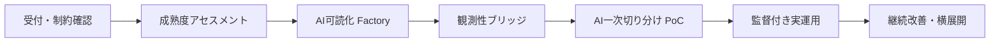

## 案の要旨

既存システムを作り直さず、各システムを「AIが扱える最小運用知識パッケージ」に変換し、既存監視と並走する形でAI一次切り分けを段階導入する。対象はまず18か月で50〜60システム、3年で150システム程度を作業仮説とし、個別コンサルではなく標準テンプレート・変換パイプライン・評価ハーネスを持つ「Legacy AI-SRE Factory」として展開する。結論として、全自動の原因特定や新規開発と同等の理解は非現実的だが、限定された障害分類・証跡付き仮説生成・ランブック提示までは多数システムへ横展開可能とする。

## 設計

### 1. 対象規模とAI可読化の定義

本案の対象規模は、初期18か月で50〜60システム、3年で150システム程度とする。数値は提供組織の人員・顧客数がブリーフにないため作業仮説であり要検証である。

「AIが分析可能なMarkdown等」とは、既存資産を完全に美しい設計書へ作り直すことではなく、障害対応に必要な情報をID付き・出典付き・更新日付きで検索・参照できる形にすることと定義する。1システムにつき、最低限以下をGit等の管理下に置く。

```text
ops-knowledge/
  system.md                 # システム概要、業務目的、重要度、担当
  components/*.md           # VM、アプリ、DB、バッチ、外部IF
  dependencies.yml          # 依存関係、通信方向、既知の単一障害点
  observability.md          # 既存監視、Zabbix項目、ログ所在、欠落情報
  alerts.yml                # アラート名、条件、影響、対応ランブックID
  slos.yml                  # 暫定SLI/SLO、測定方法、未測定項目
  runbooks/*.md             # 一次確認、切り戻し、連絡、禁止操作
  code-map.md               # モノリスの入口、主要モジュール、設定、ジョブ
  incidents/*.md            # 過去障害、原因、対応、再発防止、証跡
  glossary.md               # 業務用語、略語、暗黙ルール
```

各事実には `source`、`confidence`、`validated_by`、`last_verified` を持たせる。AIはこの知識パッケージとログ・メトリクス・アラート履歴を根拠に回答し、根拠を引用できない推論は「未確認」と表示する。

### 2. 成熟度別の適用順序

| 段階 | 典型状態 | 目的 | 適用施策 | 次段階への完了判定 |
|---|---|---|---|---|
| L0: 未把握 | Excel設計書、Zabbix、担当者依存、実態不明 | 現状把握 | アセスメント、資産棚卸し、アクセス制約確認、重要度分類 | 主要コンポーネント・担当・監視有無・過去障害有無が一覧化 |
| L1: AI可読な最低限の台帳あり | 構成・文書の一部をMarkdown/YAML化 | AI検索可能化 | Excel変換、VMディスカバリ、Zabbixエクスポート、コードマップ作成 | `ops-knowledge` 最小セットが揃い、人がレビュー済み |
| L2: 運用知識とアラートが接続済み | アラートと手順が紐づく | 一次切り分け支援 | アラートカタログ、ランブック標準化、暫定SLI/SLO、過去障害整理 | 主要アラートの70〜80%程度に対応方針が付与済み、数値は要検証 |
| L3: 観測性を補強 | 既存監視だけでは不足 | 証跡の質を上げる | 既存Zabbixを残しつつログ収集・メトリクス整理・必要ならCollector等を並走 | AIが直近アラート、関連ログ、構成変更を同一画面で参照可能 |
| L4: AI一次切り分け運用 | 知識・観測・評価が揃う | AIによる仮説生成 | RAG、障害分類、原因候補、ランブック提示、チケット下書き | 実インシデントまたはリプレイでKPI基準を満たす |

いきなりL4を目指さず、全対象をL1〜L2に上げ、重要システムのみL3〜L4へ進める。これにより「多数システム」への横展開と、高度化対象の絞り込みを両立する。

### 3. 全体プロセス



| プロセス | 入力 | 手順 | 出力 | 主担当 |
|---|---|---|---|---|
| 受付・制約確認 | 顧客申込、対象一覧、セキュリティ条件 | 外部LLM可否、閉域要件、アクセス権限、重要度を確認 | 導入可否、処理方式、優先順位 | PM、セキュリティ担当 |
| アセスメント | 設計書、監視設定、過去障害、担当者情報 | スコアリング、文書量調査、Zabbix項目確認、SMEヒアリング | L0〜L4判定、作業見積、リスク表 | SRE、AIナレッジ担当 |
| AI可読化 | Excel、PDF、コード、VM情報 | 画像化/OCR/LLM抽出、静的解析、台帳化、人手レビュー | `ops-knowledge` 初版 | AIナレッジ担当、顧客SME |
| 観測性ブリッジ | Zabbix設定、ログ、メトリクス | 既存監視を温存し、API/エクスポートでアラート台帳化、必要なログ収集を追加 | アラートカタログ、ログ参照経路、暫定SLI | Observability担当 |
| AI運用導入 | 知識パッケージ、過去障害、現行アラート | RAG、インシデントリプレイ、回答評価、運用手順化 | AI一次切り分け画面、チケット下書き、KPI | SRE、運用チーム |
| 継続改善 | 実障害、誤回答、変更情報 | ポストモーテム反映、信頼度更新、テンプレート改善 | 精度改善、横展開資産 | SRE、顧客運用責任者 |

### 4. マイルストンとスケジュール

| 期間 | 対象 | 成果物 | 完了判定 |
|---|---:|---|---|
| 0〜1か月 | 内部準備 | 標準スキーマ、アセスメント票、リスク確認票、変換手順、KPI定義 | 1システム分の模擬データで一連の手順を実行できる |
| 2〜3か月 | パイロット3システム | L1〜L2化、過去障害リプレイ、工数実績 | 各システムでAIが根拠付きの一次仮説を出し、人が評価できる |
| 4〜6か月 | 第1波10〜15システム | 変換テンプレート改善、アラートカタログ、ランブック整備 | 主要アラートと手順の紐付け、KPI初回測定 |
| 7〜12か月 | 累計30〜40システム | Factory運用、共通部品、教育資料、顧客向けレポート | 1件あたり導入工数がパイロット比で低下していること。数値は要検証 |
| 13〜18か月 | 累計50〜60システム | 監督付きAI運用、継続改善サイクル、提供メニュー化 | L2到達率、L3/L4対象のKPI、顧客合意した運用移管が成立 |
| 19〜36か月 | 最大150程度 | 自動化強化、ナレッジ横展開、人材育成 | 同一業種・同一基盤で再利用できるテンプレートが増え、個別作業比率が低下 |

### 5. 可能なこと／非現実的なこと

| 区分 | 内容 | 根拠 | 代替策 |
|---|---|---|---|
| 可能 | Excel設計書や監視設定から、運用に必要な構成・アラート・手順を抽出する | 完全変換ではなく、障害対応に必要な粒度に限定するため | 出典・信頼度付きで人手レビュー |
| 可能 | Zabbix等を残したままアラートカタログ化し、AIの入力にする | 既存監視のエクスポートや台帳化を前提にできる | 高度分析が必要な部分のみ観測性を補強 |
| 可能 | AIに一次切り分け、原因候補、確認コマンド、連絡先、チケット下書きを出させる | 知識パッケージと過去障害があれば根拠付き生成が可能 | 最終判断は人間が行う |
| 非現実的 | 全レガシーシステムを新規開発時と同等にAIが理解する | 暗黙知、古い文書、モノリス内部仕様の欠落がある | 重要障害パターンから段階的に対象化 |
| 非現実的 | Excel設計書を無検証で完全Markdown化する | 罫線・結合セル・図形・色の意味が失われる可能性がある | 画像保存、抽出結果、レビュー結果を併存 |
| 非現実的 | 非計装モノリスで分散トレース相当の原因分析を即時実現する | 観測データが存在しないため | ログ・メトリクス追加、構成変更履歴の取り込みから始める |
| 非現実的 | AIによる本番自動修復を初期から許可する | 誤判断時の影響が大きく、顧客変更管理にも抵触し得る | 読み取り専用、提案のみ、承認付き実行に制限 |

### 6. 工数見積もりの考え方と自動化限界

以下の数値はブリーフで裏取りできないため、すべて要検証の目安である。

| 資産種別 | 目安 | 自動化できる部分 | 限界 |
|---|---:|---|---|
| Excel設計書 | 1ブックあたり0.5〜2人日、図形中心は2〜5人日 | シート分類、表抽出、画像保存、Markdown草案 | セル色・罫線・図形位置に依存する意味、古い記述の真偽 |
| 手順書 | 1文書0.5〜1.5人日 | 手順番号化、前提条件・禁止事項抽出 | 暗黙の判断基準、担当者だけが知る例外 |
| モノリスコード | 1リポジトリ初期1〜3人日 | エントリポイント、設定、外部IF、バッチ一覧 | 業務ルールの完全理解、デッドコード判定 |
| Zabbix設定 | 1環境0.5〜2人日 | ホスト、トリガー、閾値、通知先の抽出 | アラートの業務影響、不要アラート判断 |
| VM構成 | 1環境1〜3人日 | OS、ミドルウェア、ポート、ジョブ、証跡収集 | 権限不足、設計書との差異の正当性判断 |
| 過去障害 | 1件0.25〜1人日 | 時系列化、原因・対応・再発防止抽出 | 記録不足、口頭対応、原因未確定 |

### 7. 横展開の仕組みとコスト低減の見立て

標準化するものは、アセスメント票、成熟度スコア、`ops-knowledge` スキーマ、Excel変換プロンプト、Zabbix取り込みスクリプト、ランブック雛形、AI評価ハーネス、顧客報告テンプレートである。

比較対象は、システムごとに個別ヒアリングし、個別形式で設計書を読み、人手で運用改善案を作る進め方とする。本案では、初回説明、文書棚卸し、監視項目抽出、ランブック整形、AI評価の工程を標準化し、特に「読み取り・転記・分類・レビュー準備」の工数を減らす。削減率や導入期間短縮幅は要検証だが、パイロット後に工程別実績を取り、見積係数として更新する。

### 8. AI障害分析のKPI

PoCでは過去障害を使い、実運用では新規インシデントを人間評価付きで測る。

| KPI | 測定方法 |
|---|---|
| 一次切り分け正答率 | 人間が確定した障害分類とAIのTop1/Top3候補を比較 |
| 根拠提示率 | AI回答が参照文書、ログ、アラートを明示している割合 |
| 誤誘導率 | 危険または明らかに誤った手順を提示した割合 |
| 初回仮説提示時間 | アラート発生からAIが仮説を出すまでの時間 |
| ランブック適合率 | 提示手順が承認済みランブックに沿っている割合 |
| 人手削減効果 | 一次確認、情報収集、チケット起票にかかった時間の前後比較 |
| MTTR影響 | 一定期間後に参考指標として比較。外部要因が大きいため単独成果とは断定しない |

### 9. 主要リスクと緩和策

| リスク | 緩和策 |
|---|---|
| 顧客が外部LLM送信を禁止 | 閉域・顧客環境内処理、匿名化、要約のみ持ち出し、モデル選択を契約で分離 |
| AIの誤判断 | 本番変更を禁止、根拠引用必須、信頼度表示、人間承認、危険操作のブロック |
| 情報整備の精度不足 | 出典管理、レビュー担当明記、サンプリング検査、古い情報の信頼度低下 |
| 体制不足 | WIP制限、役割分担、テンプレート教育、対応システム数を波で制御 |
| 顧客SMEの時間不足 | 短時間レビュー単位に分割し、未確認事項を明示して先へ進める |
| 既存監視のノイズ過多 | アラート棚卸し、重複整理、影響度分類、通知基準の見直し |

### 10. 事業面の提供形態

提供形態は3層に分ける。第一に「Legacy AI-SRE Assessment」として固定範囲の診断を提供し、導入可否と見積を出す。第二に「AI可読化 Factory」としてシステム単位でL1〜L2化を提供する。第三に「Managed AI-SRE Ops」として、L3〜L4の監督付きAI運用、KPI改善、ポストモーテム反映を月次サービス化する。

顧客価値は「AIで全自動運用できる」ではなく、属人化した運用知識の資産化、一次切り分け時間の短縮、アラートと手順の接続、障害時の説明可能性向上として示す。価格そのものは対象外だが、初期投資は変換ツール・テンプレート・評価ハーネスに寄せ、個別人月依存を下げる設計にする。

## 評価基準への適合

**c1:** L0〜L4の成熟度段階を定義し、各段階で何を適用するかを表にした。全システムを一律高度化せず、L1〜L2を横展開し、重要システムだけL3〜L4へ進める順序を明示している。

**c2:** 0〜36か月のマイルストンを、期間・対象数・成果物・完了判定付きで示した。18か月で50〜60システム、3年で150程度という対象規模も作業仮説として置いた。

**c3:** 可能なことと非現実的なことを表で分け、理由と代替策を記載した。特に全自動RCA、無検証のExcel完全変換、初期からの本番自動修復は非現実的とした。

**c4:** アセスメント、AI可読化、観測性ブリッジ、AI運用導入、継続改善について、入力・手順・出力・担当を表にした。実装開始に必要な成果物名も `ops-knowledge` として具体化した。

**c5:** 横展開の仕組みとして、標準スキーマ、変換プロンプト、Zabbix取り込み、評価ハーネス、報告テンプレートを定義した。コスト低減は、個別対応と比べて読み取り・転記・分類・評価準備の工程を減らすものと位置付け、数値は要検証とした。

**c6:** データ送信制約、AI誤判断、情報精度、体制不足、SME不足、監視ノイズをリスク表で扱った。各リスクに閉域処理、人間承認、出典管理、WIP制限などの緩和策を付けた。

**c7:** Assessment、AI可読化 Factory、Managed AI-SRE Ops の3層サービスとして事業提供形態を示した。顧客価値は全自動化ではなく、知識資産化、一次切り分け短縮、説明可能性向上として定義した。

**c8:** Excel設計書、手順書、モノリスコード、Zabbix設定、VM構成、過去障害ごとに工数目安を示し、すべて要検証と明記した。セル色・図形意味、暗黙知、業務ルール完全理解など、自動化が困難な範囲も列挙した。

**c9:** PoCと実運用で測るKPIとして、一次切り分け正答率、根拠提示率、誤誘導率、初回仮説提示時間、ランブック適合率、人手削減効果、MTTR影響を定義した。測定は過去障害リプレイと実インシデントの人間評価で行う。

## トレードオフ

この案は、新規開発時と同水準の完全なシステム理解を最初から目指さない。障害対応に効く構成・監視・手順・過去障害を優先し、詳細設計や全業務ロジックのMarkdown化は後回しにする。

また、既存ZabbixやVM運用を温存するため、観測性の水準は当面ばらつく。高度な分散トレースや自動修復よりも、既存情報の整理、アラートとランブックの接続、証跡付きAI仮説生成を優先する。

さらに、AIの判断には人間承認を必須とするため、短期的には完全自動運用による大幅な人員削減は狙わない。安全性と説明可能性を優先する代わりに、効果は一次調査時間の削減や属人知識の形式知化から出す。

## 想定される失敗モード

1. **顧客のセキュリティ制約でデータを十分に扱えない。**  
   外部LLM送信不可、ログ持ち出し不可、VMアクセス不可が重なると、AI可読化と評価が表層的になり、L1止まりになる。

2. **既存文書が実態と乖離し、AIが古い情報を根拠にする。**  
   出典と信頼度を持たせても、レビューが不足すると誤った構成や手順を提示する可能性がある。

3. **システムごとの個別性が高すぎてFactory化できない。**  
   Excel形式、監視設定、運用ルールが顧客・部署ごとに大きく異なる場合、標準テンプレートの効果が小さくなり、1件あたり工数が下がらない。

4. **過去障害記録が少なく、AI評価が成立しない。**  
   インシデント履歴や原因記録が残っていない場合、PoCで正答率を測れず、実運用での慎重な観察期間が長くなる。

## 前提と未確認事項

この案の対象数、期間、工数目安、導入効率はすべてブリーフ外の作業仮説であり要検証である。提供組織の人数、既存ツール、顧客数、顧客業種、1システムあたりの文書量・コード量・監視項目数は確認できていない。

Excel設計書の変換精度、Zabbix API等で取得できる項目、VMへのアクセス可否、ログ形式、ソースコード閲覧可否、IaCの有無は案件依存である。ここでは「読み取り権限が得られる」「顧客SMEがレビューに参加できる」ことを前提に置いた。

AI基盤についても、外部LLM、閉域LLM、顧客環境内モデルのどれを使えるかは未確認である。したがって、本案ではモデルや製品を固定せず、データ処理方式を顧客制約に合わせる前提にした。

また、一次切り分け正答率やMTTR改善率の具体的な合格ラインは、対象システムの障害件数と記録品質が分からないため確定していない。パイロット3システムでベースラインを取り、以降の契約・KPIに反映する必要がある。